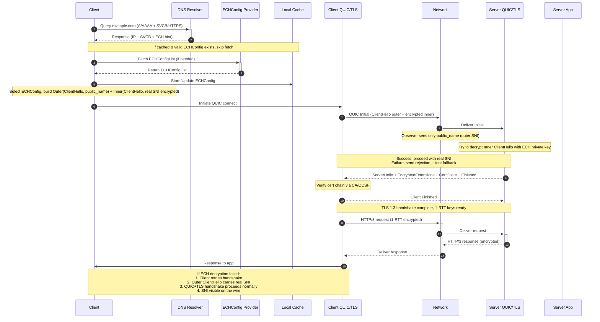

## Hi there 👋

<picture>
  <source media="(prefers-color-scheme: dark)" srcset="https://raw.githubusercontent.com/novohool/novohool/output/github-contribution-grid-snake-dark.svg">
  <source media="(prefers-color-scheme: light)" srcset="https://raw.githubusercontent.com/novohool/novohool/output/github-contribution-grid-snake.svg">
  
</picture>

## GitHub Stats

<code>
</code>
